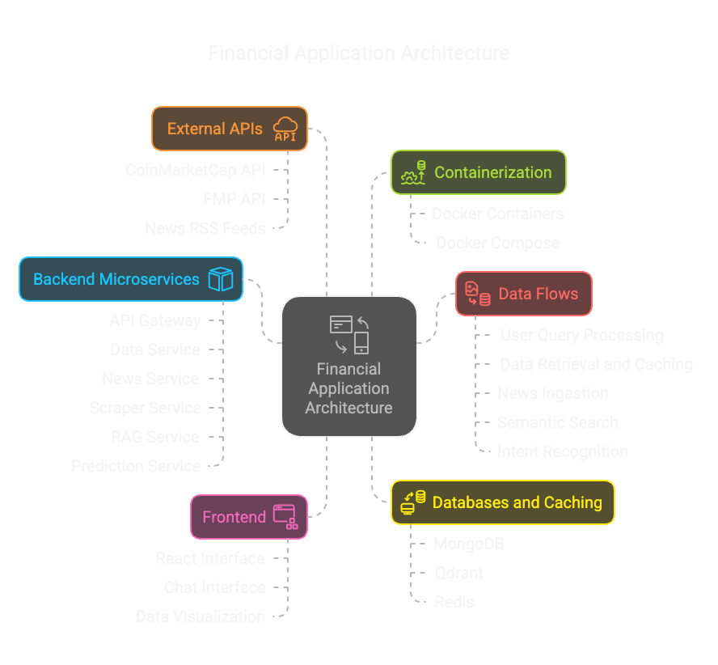

# Finance NLP Chatbot



A real-time financial assistant built with a microservices architecture that provides financial information, news, and insights through natural language processing.

## Features

- **Real-time Financial Data**: Get up-to-date stock and cryptocurrency prices from CoinMarketCap and Financial Modeling Prep (FMP) APIs
- **Financial News Pipeline**: Automated ingestion of financial news articles from RSS feeds including NY Times and CoinDesk
- **Semantic Search**: Find relevant financial information and news using natural language queries
- **Intent Recognition**: Process and understand user queries about financial markets and instruments
- **Retrieval-Augmented Generation (RAG)**: Enhanced responses using relevant financial information
- **Caching System**: Redis-based caching for optimized performance and reduced API calls
- **Responsive UI**: Clean, intuitive React-based user interface

## Architecture

The application is built using a microservices architecture with the following components:

### Frontend
- React-based user interface for interacting with the chatbot

### Backend Services
- **API Gateway**: FastAPI service that routes requests to appropriate microservices
- **Data Service**: Fetches real-time financial data from external APIs
- **News Service**: Ingests financial news articles using APScheduler and BeautifulSoup
- **Scraper Service**: Web scraping functionality for additional financial information
- **RAG Service**: Implements Retrieval-Augmented Generation for enhanced responses
- **Prediction Service**: Handles financial prediction features

### Databases
- **MongoDB**: Stores financial news articles and other structured data
- **Qdrant**: Vector database for storing and querying embeddings for semantic search
- **Redis**: Caching layer for improved performance

## Technologies Used

- **Backend**: Python, FastAPI
- **Frontend**: React
- **Databases**: MongoDB, Qdrant, Redis
- **Containerization**: Docker, Docker Compose
- **APIs**: CoinMarketCap, Financial Modeling Prep (FMP)
- **Libraries**: APScheduler, BeautifulSoup, Sentence Transformers

## Prerequisites

- Docker and Docker Compose
- API keys for CoinMarketCap and Financial Modeling Prep (FMP)

## Installation and Setup

1. Clone the repository:
   ```
   git clone https://github.com/Prithvicy/finance-nlp-chatbot.git
   cd finance-nlp-chatbot
   ```

2. Set up environment variables:
   Create or modify the `.env` file in the root directory with your API keys:
   ```
   COINMARKETCAP_API_KEY=your_coinmarketcap_api_key
   FMP_API_KEY=your_fmp_api_key
   ```

3. Build and start the services:
   ```
   docker-compose up --build -d
   ```

4. Access the application:
   - Frontend: http://localhost:3000
   - API Gateway: http://localhost:8000
   - Swagger Documentation: http://localhost:8000/docs

## Service Endpoints

- **API Gateway**: http://localhost:8000
- **Data Service**: http://localhost:8001
- **RAG Service**: http://localhost:8002
- **Scraper Service**: http://localhost:8003
- **Prediction Service**: http://localhost:8004
- **MongoDB**: mongodb://localhost:27017
- **Redis**: redis://localhost:6379
- **Qdrant**: http://localhost:6333

## Usage

1. Open the frontend application at http://localhost:3000
2. Type natural language queries about financial information:
   - "What's the current price of Bitcoin?"
   - "Show me the latest news about Tesla stock"
   - "What are the top performing cryptocurrencies today?"
   - "Tell me about recent financial regulations"

## Development

### Adding New Services

1. Create a new directory for your service
2. Add a Dockerfile and requirements.txt
3. Implement your service logic
4. Add the service to docker-compose.yml
5. Rebuild and restart the containers

### Updating Existing Services

1. Make changes to the service code
2. Rebuild the specific service:
   ```
   docker-compose up --build -d service_name
   ```

## Monitoring and Logs

View logs for all services:
```
docker-compose logs
```

View logs for a specific service:
```
docker-compose logs service_name
```

## Stopping the Application

```
docker-compose down
```

To remove volumes as well:
```
docker-compose down -v
```

## Contributing

Contributions are welcome! Please feel free to submit a Pull Request.

## License

This project is licensed under the MIT License - see the LICENSE file for details.

## Acknowledgements

- FastAPI
- React
- MongoDB
- Qdrant
- Redis
- CoinMarketCap API
- Financial Modeling Prep API
